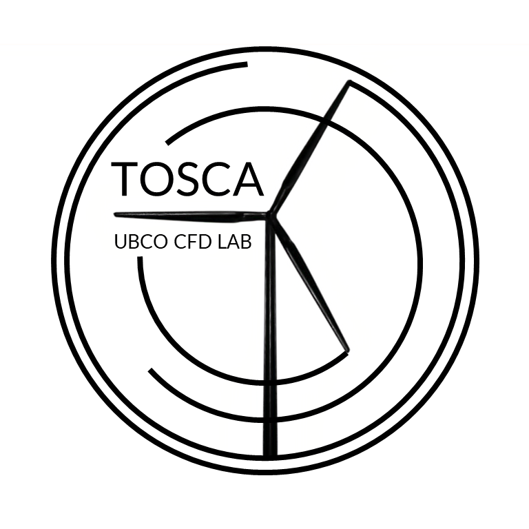

Toolbox fOr Stratified Convective Atmospheres

## Executables

    - tosca    : transient solver for stratified incompressible flows. Temperature stratification is accounted via Boussinesq approximation.
    - windToPW : post processor for ParaView visualization. Writes data in XMF/HDF format.

## Boundary Conditions

    - noSlip               : on all patches
    - slip                 : on all patches
    - zeroGradient         : on all patches
    - fixedGradient        : on all patches (only T equation)
    - inflowFunction       : only on kLeft patch. Different types of inflow can be prescribed: ABL inflow using teorethical laws, mapped inflow from a precursor
                             simulation that can be also periodized and/or interpolated if meshes are not consistent.
    - velocityWallFunction : shear stress model (only U equation). Can be prescribed on jRight and jLeft patches
    - thetaWallFunction    : potential temperature wall model (only T equation). Can be prescribed on jRight and jLeft patches

## Wall Models

    - Shumann    : applies wall shear stress in the momentum equation according to similarity theory of Paulson and Obuhkov.
                   Velocity BC is dependent (velocityWallFunction/thetaWallFunction, type -3).
    - Cabot      : prescribes velocity BC according to Cabot formulation (velocityWallFunction, type -1).

## Turbulence Models

    - Smagorinsky standard model (les 1).
    - Dynamic Smagorinsky LES turbulence model with cubic (les 3) or lagrangian (les 4) averaging.

## Turbine Models

    - UADM : base actuator disk model with imposed Ct and yaw controller
    - ADM  : advanced actuator disk model with rotor dynamics and yaw/pitch/rotation controllers

## Acquisition System

    - ABL wall-parallel planes-averaged statistics as a function of time
    - field averages
    - domain sections
    - probes with advanced parallel I/O writing
    - turbine data with advanced parallel I/O writing

## Future Implementations:

    - IBM pressure and viscous forces computation

## Notes:

    - test cases which contain an empty 'inflowDatabase' file require the inflow database. A sample database can be downloaded
      at https://drive.google.com/file/d/17F5wtI5Jc1XGh8crmOVJYVXabC8iQXq1/view?usp=sharing, simply substitute the 'inflowDatabase'
      file with the downloaded folder.

## Installation:

In order to be installed, TOSCA requires a working C/C++ compiler, PETSc (version 3.14.x, 3.15.x), Open MPI (version 4.0.x, 4.1.x), HDF5 and
HYPRE (needed by PETSs in order to build some of the matrix solvers we use). TOSCA has been tested with the above version combinations,
it could work with other combinations or versions but it has not been tested (especially older versions).
We recommend the following versions of the above libraries:
 * gcc      : 9.2.0  (https://gcc.gnu.org/).
 * PETSc    : 3.15.5 (https://ftp.mcs.anl.gov/pub/petsc/).
 * Open MPI : 4.1.2  (https://www.open-mpi.org/software/ompi/v4.1/).
 * HYPRE    : 2.20.0 (https://github.com/hypre-space/hypre/tree/hypre_petsc) (check version in /src/CMakeLists.txt).
 * HDF5     : 1.12.1 (https://www.hdfgroup.org/downloads/hdf5/).

We suggest to create a folder named 'software', where the PETSc, HYPRE and TOSCA folders will be located.

Prior to install TOSCA, we suggest creating a folder named `Software` inside $HOME, where all the following steps will be performed.
In order to compile TOSCA on your system, please follow these steps:

* Check your compiler version with `gcc --version`

* Download PETSc into `$HOME/Software/`

* Download HYPRE `$HOME/Software/`

* Download Open MPI: you can download the binaries or compile from source (the latter is recommended if use `environment-modules`).
  If you have only one version of Open MPI installed on your system in the `/usr` directory (using sudo for example), you can omit the
  `--with-mpi-dir='your--path--to--mpicc'` at point 4: Open MPI will be found by the 'ld' library locator.

* Configure PETSc (will automatically compile HYPRE). We suggest the following configure options:
  `./configure --with-fc=0 --download-f2cblaslapack --with-mpi-dir='your--path--to--mpicc' --download-hypre='your--path--to--hypre \
  --with-64-bit-indices=1 --with-debugging=0`

* Make PETSc with `make all`

* Test PETSc with `make check`

* Save an environment variable that will tell TOSCA where PETSc is installed in your .bashrc:
  `echo "export PETSC_DIR=$HOME/your--path--to--petsc" >> $HOME/.bashrc`

* Save an environment variable that will tell TOSCA which PETSc architecture is required in your .bashrc. Note: this is the folder within $PETSC_DIR with a name beginning with "arch-". In a typical installation, it will be "arch-linux-c-opt":
  `echo "export PETSC_ARCH=arch-linux-c-opt" >> $HOME/.bashrc`
  
* Add the PETSc shared libraries to your library path environment variable in your .bashrc:
  `echo "export LD_LIBRARY_PATH=$LD_LIBRARY_PATH:$PETSC_DIR/$PETSC_ARCH/lib" >> $HOME/.bashrc`

* Reload the environment with `source $HOME/.bashrc`

* Go inside TOSCA/src directory and compile the executables with `make tosca` and `make windToPW`

* Test the installation by copying `tosca` and `windToPW` in one of the example cases and run the simulation
  and the post-processing with `./tosca` and `./windToPW` respectively. To run in parallel you have to use
  `mpirun -np 'your-number-of-processors' ./tosca`

Credits and Copyright: Sebastiano Stipa - Arjun Ajay - Mohammad Hadi - The University of British Columbia
