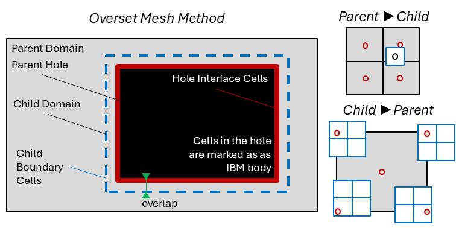

.. _overset-section: 

Overset Mesh 
------------

Overset mesh allows to introduce refinement levels within TOSCA. In this technique, a finer mesh is immersed inside the original 
background mesh. Boundary conditions for the finer mesh are interpolated from the background mesh, while cells in the background mesh 
are blanked when they overlap with the finer mesh. This "hole" in the background mesh is treated as an IBM body (see :ref:`ibm-section`), 
where the solution at the IBM fluid cells is interpolated from the finer mesh. In order to understand how the overset mesh method works 
in TOSCA, it is worth mentioning some nomenclature used in relation to the following figure:

.. raw:: html

     

A parent domain is a domain that fully contains another domain, usually characterized by a finer mesh, referred to as the child domain. 
Since the parent encloses the child, a hole can be created, a few cells inwardly offset from the child, where parent domain cells are not 
solved. This is referred to as the parent hole, which is treated as an IBM body. Hole interface cells are IBM fluid cells where the solution is 
interpolated from the child domain. Vice versa, the solution is interpolated from the parent domain at the child boundary cells. The offset 
between the hole and the child domain is required in order to use centered interpolation stencils when interpolating from the parent to the child 
domain. Finally, donor and acceptor cells are those cells that provide and receive the interpolaton data, respectively. Parent and child domains 
have both donor and acceptor cells, depending if the interpolation is from parent to child or vice versa. Regarding the interpolation, when this 
goes from parent to child (coarse to fine), a tri-linear scheme is used. Conversely, when going from child to parent (fine to coarse), a tri-linear 
scheme would make the interpolated value too local if the parent to child grid ratio is too large. For this reason, TOSCA introduces a 
tri-linear averaged interpolation, where cell corners are first tri-linearly interpolated and then averaged to yield the cell value, as shown 
in the figure above. 

In order to activate the overset mesh method in TOSCA, the first thing to do is to activate the ``-overset`` flag in the *control.dat* file. 
This prompts TOSCA to read the *oversetInput.dat* file, located inside the *overset* directory. This file contains entires that are 
used to define multiple domains and their mutual hierarchy. When overset is active, TOSCA's case structure changes slightly, as one extra level 
of directory is added. In fact, assuming that two domains are defined, named *background* and *overset*, the minimal case structure becomes: 

.. code-block:: bash

    case_directory
    ├── control.dat
    ├── background.xyz
    ├── overset.xyz
    ├── boundary
    │   ├── background
    │   │   ├── U  
    │   │   └── nut
    │   └── overset
    │       ├── U
    │       └── nut
    ├── overset
    │   └── oversetInput.dat  
    └── IBM
        └── hole

Notably, additional domains can be defined, which will change the directory structure accordingly. There should be a hole body for each child domain, 
and as many mesh files and boundary sub-directories as many domains are defined. Finally, a parent domain can have multiple child domains,
but a child domain can only have one parent domain. 

`oversetInput.dat` 
~~~~~~~~~~~~~~~~~~

The *oversetInput.dat* file defines the hierarchy of the domains, their mesh files and their hole bodies. We show below the syntax of the file 
for the example provided in the TOSCA repository inside *tests/multiDomainOverset*. In this example, four domains are defined. An outer 
domain, with two child domains, and an additional child domain in one of the previous child domains. 

.. code-block:: c
   
   # TOSCA Input file - Overset Input Properties
   # -------------------------------------------

   MeshTotal      4 // integer, total number of meshes
   numHoleObjects 3 // integer, number of hole objects
   dynamicOverset 0 // (not supported yet) 1 if the overset mesh is moving

   Mesh0 
   {
       name       outer // string, name of the domain
       parentMesh (-1)  // integer, -1 if parent is the background domain
       childMesh  (1 3) // list of child meshes, -1 if no child
       windPlant  0     // 1 if the domain contains wind turbines 
       ibm        0     // 1 if the domain contains an IBM body
   }

   Mesh1 
   {
       name       inner1 // string, name of the domain
       parentMesh (0)    // integer, -1 if parent is the background domain
       childMesh  (2)    // list of child meshes, -1 if no child
       windPlant  0      // 1 if the domain contains wind turbines 
       ibm        0      // 1 if the domain contains an IBM body
   }

   Mesh2 
   {
       name       inner2 // string, name of the domain
       parentMesh (1)    // integer, -1 if parent is the background domain
       childMesh  (-1)   // list of child meshes, -1 if no child
       windPlant  0      // 1 if the domain contains wind turbines 
       ibm        1      // 0 if the domain doesn't contain an IBM body
   }

   Mesh3 
   {
       name       inner3 // string, name of the domain
       parentMesh (0)    // integer, -1 if parent is the background domain
       childMesh  (-1)   // list of child meshes, -1 if no child
       windPlant  0      // 1 if the domain contains wind turbines 
       ibm        0      // 1 if the domain contains an IBM body
   }

   holeObject0
   {
       bodyNamr        outerHole1    // string, name of the hole body
       ownerMesh       0             // integer, index of the parent domain
       donorMesh       1             // integer, index of the child domain
       bodyType        closedBody    // string, see IBM
       fileType        ucd           // string, see IBM
       baseLocation    (0.0 0.0 0.0) // vector, see IBM
       searchCellRatio 3             // integer, see IBM
   }

   holeObject1
   {
       bodyNamr        outerHole2    // string, name of the hole body
       ownerMesh       0             // integer, index of the parent domain
       donorMesh       3             // integer, index of the child domain
       bodyType        closedBody    // string, see IBM
       fileType        ucd           // string, see IBM
       baseLocation    (0.0 0.0 0.0) // vector, see IBM
       searchCellRatio 3             // integer, see IBM
   }

   holeObject2
   {
       bodyNamr        outerHole3    // string, name of the hole body
       ownerMesh       1             // integer, index of the parent domain
       donorMesh       2             // integer, index of the child domain
       bodyType        closedBody    // string, see IBM
       fileType        ucd           // string, see IBM
       baseLocation    (0.0 0.0 0.0) // vector, see IBM
       searchCellRatio 3             // integer, see IBM
   }

Notably, the name of the mesh objects should be the name of the mesh files without the extension. For example, if the mesh file is
*background.xyz*, the name of the mesh in the *oversetInput.dat* file should be *background*. The same applies to the hole bodies, as 
they will be looked for inside the *IBM* directory. Currently, wind turbines can be defined inside more than one overset domain, as 
TOSCA expects domain-specific directories *turbines/meshName* for each domain, where the file structure described in :ref:`turbines-section`
should be followed. This is not true for the IBM, as TOSCA does not make this distinction. Hence, IBM can only be activated in one domain and 
the directory structure described in :ref:`ibm-section` should be followed (with the addition of the hole objects).

Boundary conditions for the overset mesh are defined in the same way as for a normal simulation, except that the boundary condition files should 
be placed inside the *boundary/meshName* sub-directory, as they are domain-specific. For child domains, at the boundaries where one wants to 
interpolate from the parent domain, the boundary condition should be set to *oversetInterpolate*. Notably, not all boundaries always have to be 
interpolated from the parent domain. For example, if the bottom boundary of the child domain is a wall, the boundary condition should be set to 
*noSlip*, or a wall model should be used. Interpolation at the hole interface cells is done automatically by TOSCA, so no boundary condition
is needed for those cells. 

`Hole Object Files` 
~~~~~~~~~~~~~~~~~~

The hole object files should be provided in the same format as the IBM body files (see :ref:`ibm-section`). Being simple cuboids, these files are 
pretty easy to generate and an advanced mesher is not required. In fact, a simple python script could be used to generate a minimal hole object file 
having 2 triangles per face. The following shows an example of a hole object file that can be used for overset simulations in TOSCA. The user can 
adapt the coordinates of the 8 points in order to define its own hole for its specific case. Notably, it is important that the hole object has an inward offset 
of at least 3 parent domain cells (or more) from the child domain bounds, in order to allow for a centered interpolation stencil. This is not checked by TOSCA, and errors to comply 
with this requirement will lead to a crash during initialization.

.. code-block:: C

    # UCD Geometry file crated by custom python script 
    #
    #
    8 12 0 0 0
    1 -6.83333e+02 -4.33333e+02 0.00000e+00
    2  6.83333e+02 -4.33333e+02 0.00000e+00
    3  6.83333e+02  1.13333e+03 0.00000e+00
    4 -6.83333e+02  1.13333e+03 0.00000e+00
    5 -6.83333e+02 -4.33333e+02 1.20000e+02
    6  6.83333e+02 -4.33333e+02 1.20000e+02
    7  6.83333e+02  1.13333e+03 1.20000e+02
    8 -6.83333e+02  1.13333e+03 1.20000e+02
    1  0 tri 1 2 3
    2  0 tri 1 3 4
    3  0 tri 5 6 7
    4  0 tri 5 7 8
    5  0 tri 1 2 6
    6  0 tri 1 6 5
    7  0 tri 2 3 7
    8  0 tri 2 7 6
    9  0 tri 3 4 8
    10 0 tri 3 8 7
    11 0 tri 4 1 5
    12 0 tri 4 5 8

    
