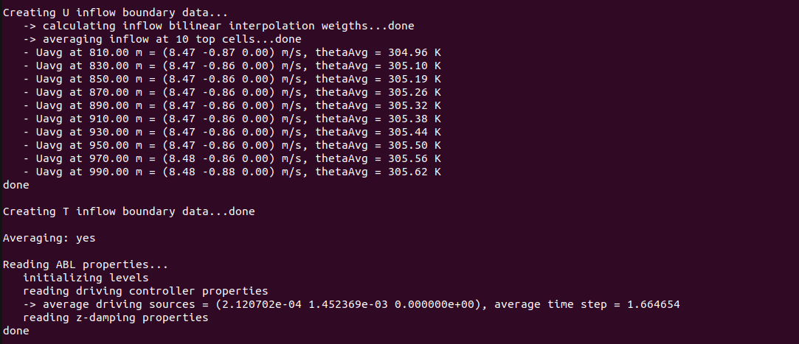

.. _examples_successor_periodized_test:

Wind Farm Successor Example - Inlet/Outlet
------------------------------------------

The *tests/SuccessorPeriodizedTest* example case shows how to use the *inflowDatabase* created in the :ref:`examples_neutral_abl_test` as inlet boundary condition 
for a wind farm simulation. Unlike the :ref:`examples_nrel5mw_test`, this test case features 4 wind turbines instead of an isolated rotor.
Wind turbines are still represented using the ADM, and the simulation also includes the solution of the potential temperature field. Finally, 
a few probes are inserted in the domain in order to showcase their usage. 

The domain extends for 1000 m in the x, 2000 m in the y and 4675.48 m in the z direction. The mesh is stretched along z so that 
the vertical resolution transitions from 20 to 150 m. **Please note that this set up is only intended to show how to define TOSCA cases and it does not 
apply for production runs or research simulations**. The x and y coordinates of the 4 wind turbines are (200, 1000), (830, 1000), (500, 500) and (500, 1500),
as defined in the ``turbines/windFarmProperties`` file. Notably, the third turbine is waking the last one. 

In order to specify the inflow boundary condition, data produced by running the :ref:`examples_neutral_abl_test` should be used. We suggest the user 
to run that example case first if they are not already familiar with how to generate the inflow data. Alternatively, the dataset can be downloaded at `this <https://drive.google.com/file/d/17F5wtI5Jc1XGh8crmOVJYVXabC8iQXq1/view?usp=sharing>`_ link.
The user should place the ``inflowDatabase`` directory (either downloaded or generated) in the same directory as the TOSCA case, thereby removing the 
``inflowDatabase`` file, which is just there as a place-holder. The mesh used to generate the inflow data is 1000 m in x, y and z, so the z-normal slices, which are 
read by TOSCA at each iteration in order to provide a suitable boundary condition, should be manipulated to match the domain of the current case.
This is automatically done by TOSCA by correctly setting the parameters which define the inflow boundary condition in the ``boundary/U``, ``boundary/T`` and ``boundary/nut`` files. In this example, 
the inflow data should be tiled twice in the y direction (as the domain is 2000 m in y) and extrapolated in the z direction. Please note that TOSCA also allows to tile 
the data in the vertical direction, but this operation would not make sense here as the inflow data contains a neutral ABL profile. For certain simulations, it may 
be worthwhile to make the inflow data exactly steady above the boundary layer in order to avoid numerical problems with atmospheric gravity waves triggered 
by the wind farm. In this regard, TOSCA allows to set the extrapolated data in the vertical direction as the time- and spanwise averaged value at the last available cell in z from the inflow slice.
In order to avoid an abrupt change from transient and artificially steady inflow, the profile slowly transitions to a steady profile in the last 10 mesh cells. This means 
that the data will be transient at the *N-10* th cell, while at the *N* th cell the flow will be steady. The user cannot control the number of cells over which the smoothing 
is performed. A correct mapping of the available inflow data onto this case domain can be achieved by setting the following ``kLeft`` boundary condition in the ``boundary/U``, ``boundary/T`` and ``boundary/nut`` files:

.. code-block:: C

    kLeft   inletFunction
            {
                type          4        // unsteady interpolated inflow 
                n1Inflow      50       // n cells along z in the inflow data
                n2Inflow      50       // n cells along y in the inflow data
                n1Periods     1        // do not tile along z (will extrapolate)
                n2Periods     2        // tile twice along y
                interpolation spline   // spatial interpolation method
                sourceType    uniform  // inflow data has uniform mesh
                cellWidth1    20       // inflow data cell width in z
                cellWidth2    20       // inflow data cell width in y
                n1Merge       1        // perform time smoothing at last 10 cells
                n2Shift       0        // no data shift in y
                shiftSpeed    1.5
            }

Notably, in this case the inflow data and the target data have the same mesh of 20 by 20 m, so also the ``inflowFunction`` *type 3* could have been used (see Sec. :ref:`boundary-subsection`).
The boundary condition displayed above can also be used if one wants to stretch the domain mesh in y and z directions, as long as the inflow mesh is uniform. If the inflow mesh is 
stretched along y and z, then the user should select ``sourceType`` to *grading*, and the ``cellWidth1`` and ``cellWidth2`` parameters would not be required 
anymore. Instead, TOSCA would read the inflow mesh from the ``inflowDatabase`` directory. 

Finally, since only the inflow data is available rather than the full 3D field, the user should set the ``internalField`` of all fields to *spreadInflow* and wait this 
dummy initial condition to be washed away after one flow-through time.

Together with the inflow data, one must also provide the momentum source terms that balance the Coriolis force. These should have been previously calculated and are also 
contained in the ``inflowDatabase`` directory. In orer for TOSCA to read these data, the user should set the following parameters (among those prescribed in the example) in the ``ABLProperties.dat`` file:

.. code-block:: C

    coriolisActive            1    
    controllerActive          1
    controllerActiveT         0

    controllerProperties 
    {
        controllerAction       read
        controllerType         timeAverageSeries 

        controllerAvgStartTime 1000
    }

This will average the source data contained inside ``inflowDatabase/momentumSource`` from 10k to 12k s and apply it to the domain from the start time.  
Failure to do so with the ``coriolisActive`` parameter set to 1 wil determine a flow evolution as it enters the domain, which is due to the fact that the 
existing veer does not corrispond to the new geostrophic equilibirum condition anymore. 

The ``control.dat`` file should be set in order for the simulation to start at a time which is contained in the inflow data. If this is not the case, 
TOSCA will try to extrapolate the inflow data, likely resulting in very high values of the velocity field applied at the inlet.  The most important settings to notice for this example are: 

.. code-block:: C

    -startFrom      startTime       
    -startTime      10000          // inflow data is from 10k to 12k s             
    -endTime        11000          // should be contained in inflow data

    -intervalType   adjustableTime // time step adjusted based on cfl and acq. frequency
    -timeInterval   100            // checkpoint frequency

    -potentialT     1              // solve potential temperature equation
    -abl            1              // requires ABLProperties.dat file
    -zDampingLayer  1              // defined in ABLProperties.dat file

    -probes         1              // read probes from sampling/probes directory

Notably, different probe files are contained inside the ``sampling/probes`` directory. Each of these probe files is referred to as a probe rake. The position of all the probes 
within a rake identifies the number of processors that control the rake, so that probe data from many different rakes can be written to disk simulatenously if the controlling 
processors are different. The probes subdivision among processors cannot be controlled by the user, but it is automatically assigned by TOSCA. The best way to split the probes 
is to define only probes close to each other in the same file/rake, this will increase the chances that each processor does not control more than one rake. In this example, the 
probe rakes are composed by two probes, which are the same in some of them as they are just meant to be an example. 

Once the case is set up, the user can run the simulation by executing:

.. code-block:: bash

    mpirun -np 4 ./tosca 

in order to run with four processors. At the simulation start, the code will print useful information regarding the input settings, inflow and probe data. The following image shows how 
the code prints the flow averages at the last 10 cells in the z direction, calculated from the inflow data, when ``n1Merge`` is set to 1 in the boundary condition. These are particularly useful when using 
inflow/outflow boundary conditions in combination with ``-kLeftRayleigh`` or ``-kRightRayleigh`` functionalities, as these require the user 
to provide the average values of the fields that the source terms in these regions are trying to attain, which should be consistent with the boundary 
conditions.  

.. raw:: html

     

The following image shows the initialization of the wind turbines. In particular, TOSCA performs some checks, based on best practices, and informs the 
user if the parameters are not used as expected by the state-of-the-art in wind farm simulations. Furthermore, while TOSCA features a fully consistent wind turbine restart, this is 
not performed here as wind farm simulation is started from scratch. In this case, TOSCA sets the wind turbine configuration as that defined by the input files.

.. image:: ./images/successor_periodized_test_turbines.png
    :width: 100%

.. raw:: html

     

The following image shows the ouput from the probe initialization. The code prints some useful information regarding each probe rake such as the 
processor that will perform the writing, the path to the output data, the fields gathered, acquisition start time and some additional 
info for each probe contained in the rake. 

.. image:: ./images/successor_periodized_test_probes.png
    :width: 100%

.. raw:: html

     

Once the simulation has completed, sections and 3D fields can be visualized in *ParaView* by converting the TOSCA outputs in *.hdf* and *.xmf* formats. 
This can be done by running

.. code-block:: bash

    ./tosca2PV
  
which will also slice the average fields, if present, as explained in Sec. :ref:`acquisition-section`. 

Finally, the following image shows the visualization of the
velocity and potential temperature fields at the end of the simulation. The tiling and extrapolation procedure of the inflow data can be observed as 
coloured rectangles indicate the available inflow data (black), the data tiled in the y direction (magenta) and the data extrapolated in the z direction (blue).    

.. image:: ./images/successor_periodized_test_field.png
    :width: 100%

.. raw:: html

     

      
