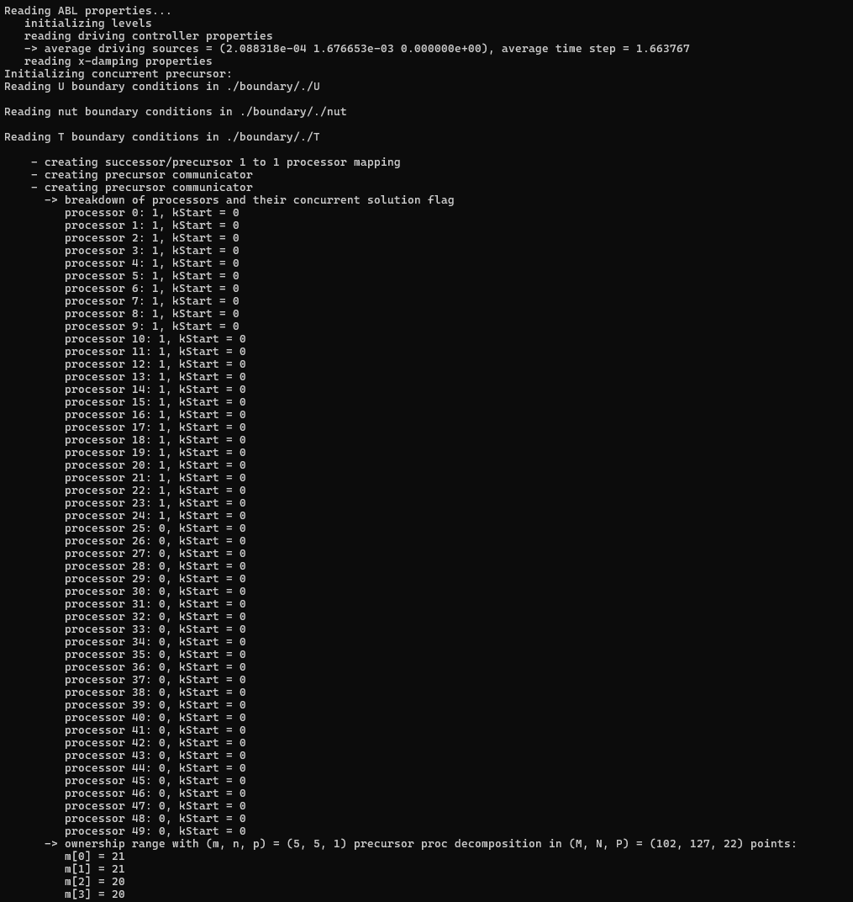

.. _examples_successor_periodized_fringe_test:

Wind Farm Successor Example - Concurrent Precursor
--------------------------------------------------

The *tests/SuccessorPeriodizedFringeTest* example case extends the :ref:`examples_successor_periodized_test`, demonstrating how to run the 
same case using an inlet fringe region and the concurrent precursor method. 

In this method, two simulations are carried out in sync, namely the wind farm simulation, referred to as the successor, and the precursor 
simulation, which provides the unperturbed and time-resolved ABL flow that is desired at fringe region exit. The wind farm domain 
features periodic boundary conditions on all lateral boundaries, this means that flow perturbations are re-advected at the inlet, e.g. leading to the 
wind farm being impinged by its own wake. This effect can be eliminated through specialized source terms, applied 
throughout the fringe region, which aim at removing any flow perturbation (caused by e.g. the wind turbines), thereby bringing the flow solution back 
to its uperturbed, time-varying ABL state. This state is referred to as the reference state in fringe region nomenclature. If the reference state is steady, 
the fringe region is referred to as Rayleigh damping layer (a Rayleigh damping layer will be applied at the domain top, where the flow is non-turbulent), 
and an additional simulation is not required for its computation. Conversely, if the reference state is time-resolved, it varies both in space 
and time at each iteration, and so it needs to be retrieved from an additional simulation that runs concurrently with the wind farm simulation.
This is done to avoid reading the unsteady 3D reference state from file at each time step, which would be unfeasible both from a I/O and storage perspective.

The concurrent precursor can be both auto-sustained by using periodic BCs on all lateral boundaries, or fed with an *inflowDatabase*. In the first case,
a spin-up phase is required to develop the turbulent ABL, while in the second case it is only necessary to wait one flow-turnover time for the precursor domain 
to be completely filled with the inflow data. In this example, the *inflowDatabase* created in the :ref:`examples_neutral_abl_test` is used as inlet boundary 
condition to drive the flow in the concurrent precursor (this data can also be found at `this <https://drive.google.com/file/d/17F5wtI5Jc1XGh8crmOVJYVXabC8iQXq1/view?usp=sharing>`_ link). 
Wind turbines are represented this time using the *uniformADM* model, and the simulation also includes the solution of the potential temperature field.  
A few probes are inserted in the domain in order to showcase their usage and the *-average3LM* acquisition utility is also activated in order to 
compute depth-averaged quantities in three user-defined layers.  

When the simulation includes potential temperature, gravity waves can develop in the domain. These waves then reflect at the boundaries, polluting the flow 
solution. It has been shown in literature that fringe and Rayleigh damping regions applied at the domain boundaries, if correctly designed, help avoiding this effect.
Without concurrent precursor method, i.e. using inflow-outflow BCs, one would require three fringe regions, namely at the inlet, outlet and domain top. Moreover, it becomes difficult to 
apply the inflow and outflow reference states inside the ABL, as they are turbulent and hence time-varying. For this reason, finite-volume codes usually use 
Rayleigh damping regions at all boundaries, with the inlet and outlet Rayleigh damping regions not extending inside the boundary layer. This might work in some cases, but it is 
far less reliable. For instance, perturbances very close to the ABL top are not damped and it is challenging to choose suitable steady reference states to 
be applied above the ABL. Inlet and outlet Rayleigh damping regions can be applied in TOSCA using the ``-kLeftRayleigh`` and ``-kRightRayleigh`` options in the 
``control.dat``, but they are not used in this example. At the top, the Rayleigh damping region is applied using the ``-zDampingLayer`` option, which can 
work as a hybrid Rayleigh-fringe region depending if source terms are only applied in the vertical direction (steady) or also in the horizontal (unsteady). 
For wind farm simulations that combine a fringe region at the inlet with a Rayleigh damping region at the top, horizontal and vertical damping is operated by the fringe region,
while the Rayleigh damping region should only damp in the vertical direction. As a consequence, the ``zDampingAlsoXY`` option in the ``zDampingProperties`` dict in *ABLProperties.dat* 
is turned off.

In some cases, the concurrent precursor method and inlet fringe region might not be enough to avoid gravity waves reflections, hence an advection damping layer around 
the exit of the fringe region is added, where the horizontal advection of vertical velocity is turned off in order to avoid the propagation of these verical perturbations 
downstream. It is always good practice to use this feature, as it is now state of the art in LES of wind farm and terrain induced gravity waves. Finally, lateral fringe 
region might be needed in some cases (not shown here), and its usage in TOSCA is described in the *tests/SuccessorPeriodizedLateralFringeTest*. 

The domain size is the same as the one used in the :ref:`examples_successor_periodized_test`, and the same applies to the wind farm layout with the wind turbine 
model set to *uniformADM* in the *turbines/windFarmProperties* file. Moreover, instead of mapping the inflow data to the successor domain, the *inflowDatabase* 
is used to drive the flow in the precursor domain through the ``-precursorSpinUp`` flag set to 1. Notably, setting this flag to 0 will apply lateral periodic boundary 
conditions on the precursor as well, while a value of 1 reads from the *inflowDatabase* and initializes the flow using ``spreadInflow``. To change the initialization 
to read the initial condition from *fields/precursor* directory, for restart, the ``-precursorSpinUp`` needs to be set to 2. Top and bottom 
boundary conditions automatically set by TOSCA to be the same as the successor domain. For the latter, boundary conditions are set to *periodic* on all lateral boundary, 
whereas the same boundary conditions as the :ref:`examples_successor_periodized_test` are used for the top and bottom boundaries. Note that, in order to simplify the simulation 
set up when the concurrent precursor method is used, the user does not need to specify boundary conditions for the precursor domain, as this operation is done internally 
by the TOSCA code.

Apart from the boundary conditions, the main difference with the :ref:`examples_successor_periodized_test` can be found in the *control.dat* and *ABLProperties.dat* files. 
In the first, the inlet and top fringe regions are activated through the ``-xDampingLayer`` and ``-zDampingLayer`` options, while the advection damping region is enforced 
through the ``-advectionDamping`` flag. This prompts the code to read the respective dictionaries in the *ABLProperties.dat* file, where the fringe and advection damping 
regions properties are defined. The inlet fringe region is defined as follows: 

.. code-block:: C

    xDampingProperties
    {
        xDampingStart   0                    // start of the fringe region
        xDampingEnd     200                  // end of the fringe region
        xDampingDelta   50                   // rising/decaying length of the 
                                             // fringe activation function
        xDampingAlpha   0.7                  // damping coefficient
        xDampingAlphaControlType alphaFixed  // maintains alpha constant
        
        uBarSelectionType 3                  // 3 = CONCURRENT PRECURSOR!
        
        n1Inflow 50                          // these are the inflow function 
        n2Inflow 50                          // settings for the concurrent 
        n1Periods 1                          // precursor method
        n2Periods 2
        n1Merge   0 
        interpolation spline
        sourceType uniform
        cellWidth1 20
        cellWidth2 20
        n2Shift    0
        shiftSpeed 1.5
    }

The first thing to notice is the ``uBarSelectionType`` set to 3, which indicates that the reference state is provided by the concurrent precursor.
This setting prompts TOSCA to create a new simulation instance that will run concurrently with the wind farm simulation. The user does not need to 
specify the mesh for the precursor domain, as this is internally calculated by TOSCA, including the handling of the domain decomposition. The phylosophy 
under which this is achieved is the following: 

1. Processors that are (fully or partially) contained in the fringe region are selected. 
2. Cells that belong to these processors are selected and will be used to create the new mesh.

This means that the precursor domain is only solved by a subset of the processors used for the wind farm simulation. The remaining processors 
will idle while the precursor time step is carried out. If the time step is adjustable based on the CFL condition, the maximum velocitu between the two 
domains will be used to compute the most restrictive time step. The idea to only use a subset of the processors makes sure that, if the wind farm simulation 
is run with the optimal cell-per-processor ratio, the same ratio is also employed for the precursor simulation.

The entries below the ``uBarSelectionType`` are required to set the inflow function for the concurrent precursor method, activated using ``-precursorSpinUp`` 
equal to 1 or 2 in the *control.dat* file, and correspond to the ``inletFunction`` type 4. Notably, **they are not required** if ``-precursorSpinUp`` is set t 0. The ``n1Inflow`` and ``n2Inflow`` entries define the 
number of cells in the x and y directions of the inflow data, respectively, while ``sourceType uniform`` indicates that the inflow mesh is uniform with widths of 
20 m in both directions. The ``n1Periods`` and ``n2Periods`` entries define the number of tiles in the y and x directions, respectively, while ``n1Merge`` indicates 
the inflow data is averaged at the top 10 cells, making the inflow truly steady above. In this example, the inflow is periodized 2 times in the y direction and 1 time 
in the z direction. Above the available data, the precursor inlet patch is padded with the last value that is found in the inflow database. For more information on 
the inflow function, please refer to the :ref:`inlet-functions-subsubsection`. The ``shiftSpeed`` entry may be optionally set to laterally shift the inflow data and 
remove the streamwise turbulent streaks that sometimes produce a slow convergene of the turbulence statistics. 

Settings related to the vertical damping layer are simpler, namely:

.. code-block:: C

    zDampingProperties
    {
        zDampingStart   1000    // x start of the fringe region
        zDampingEnd     4675.48 // x end of the fringe region
        zDampingAlpha   0.01    // damping coefficient
        zDampingAlsoXY  0       // Rayleigh damping layer mode, 
                                // only damps vertica velocity
    }  

In this example, the vertical damping region is used in Rayleigh damping mode, meaning that only the vertical velocity is damped. The reference state does not need to 
be specified, as it is always zero (there should be no vertical velocity perturbations close to a flat slip boundary). 

Finally, the advection damping region is defined as follows:

.. code-block:: C

    advectionDampingProperties
    {
        advDampingStart       200
        advDampingEnd         600
        advDampingDeltaStart  100
        advDampingDeltaEnd    100
    }

This region is the simplest to set, as only geometrical parameters are required. 

.. note::

    The important aspect about fringe, Rayleigh and advection damping regions is that they have to be properly set in order to have a positive effect on the solution. 
    Wrong settings may lead to a non-physical solution, or worse case, to a crash of the simulation. The settings provieded in the current example are just 
    explanatory and should be adapted to the specific case. Detailed information on how to set these regions can be found `here <https://wes.copernicus.org/articles/9/297/2024/#section9>`_ 

For the concurrent precursor, the remaining simulation parameters (solver, controller, etc.) are automatically set to be the same as the wind farm simulation.
Lastly, in order to execute the ``-average3LM`` acquisition utility, the additional *3LM* file is required inside the *sampling* directory. This contains the 
specification in terms of horizontal diretization and vertical depth, of each of the three layers where velocity and pressure perturbations are depth averaged and where the 
boundary layer height is computed. The file is structured as follows:

.. code-block:: C

    nstw         20            // streamwise n cells
    nspw         20            // spanwise n cells
    upDir        (0.0 0.0 1.0) // upward direction
    streamDir    (1.0 0.0 0.0) // streamwise direction	
    xSample      500           // x position where unperturbed fields 
                               // are oberved

    avgStartTime 0.0           // start time of perturbation fields average
    avgPeriod    1.5           // period of perturbation fields average

    level1
    {
        hStart   0.0           // start z of 1st layer
        hEnd     180.0         // end z of 1st layer
    }

    level2 
    {
        hStart   180.0         // start z of 2nd layer
        hEnd     260.0         // end z of 2nd layer
    }

    level3
    {
        hStart   260.0         // start z of 3rd layer
        hEnd     1000.0        // end z of 3rd layer
    }

The case can be run in parallel (using e.g. 10 processors) using the following command:

.. code-block:: bash

    mpirun -np 10 ./tosca 

When the simulation is started, the user will notice that the concurrent precursor is selected, and a new simulation instance is 
initialized. Processor mapping is automatically handled by TOSCA, and will be printed to screen for information. The simulation startup 
is shown in the following figure:

.. image:: ./images/successor_periodized_fringe_test_startup_10procs.png
    :width: 100%

.. raw:: html

     

Notably, the *concurrent solution flag* is set to 1 for all processors as, for this configuration, all processors own at least one fringe region cell. 
If more processors are used, e.g. 50, the simulation startup will look as follows:

.. raw:: html

     

As can be noticed, starting from the 25th processor, the *concurrent solution flag* is set to 0, as processors from 25 to 99 do not own any fringe region cell. After the concurrent 
precursor mesh creation case, the mesh file is written in the case directory so that precursor fields can be later processed using the utility ``tosca2PV`` and visualized in ParaView. 
The user has to make sure that the first lines of the wind farm mesh file (those specifying the periodicty, if any) are correctly copied to the precursor mesh file.
This might not be always done automatically, especially when the ``-precursorSpinUp`` flag is active. The user can check the mesh file and, if needed, modify it. 

The simulation runs for 1000 seconds, and the results will be written in the *fields* directory. As can be seen, a *precursor* subdirectory is created, where the 
concurrent precursor fields are written. All sections defined for the wind farm simulation are also created for the precursor simulation. Moreover, the flag 
``-averageABL`` is always invisibly active for the precursor simulation, and so the ``-avgABLPeriod`` and ``-avgABLStartTime`` needs to be always specified in the 
*control.dat* file.  

The following figure shows the simulation setup, with the position of the fringe region (blue), the Rayleigh damping region (red) and the advection damping 
region (green). The wind farm domain is shown with opacity, together with a horizontal section through the hub-height of the wind turbines. 
A concurrent precursor section, at the same height, is also shown in front of the wind farm domain for clarity, but in reality it is contained in the blue region, as 
the concurrent precursor domain coincides with the fringe region. 

.. image:: ./images/successor_periodized_fringe_test.png
    :width: 100%

.. raw:: html

     

As can be seen, the wakes of the wind turbine that are leaving the domain are re-advected at the inlet by the periodic boundary conditions, but are then eliminated 
by the fringe region. The same setup, with different settings, can be used to study terrain and wind farm induced gravity waves, avoiding wave reflections at the domain 
boundaries. 