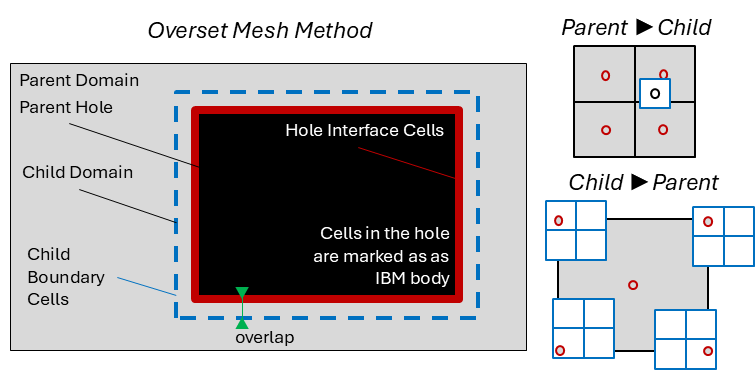

.. _overset-theory-section:

Overset Algorithm
-----------------

Overset mesh (also known as grid nesting) allows to introduce refinement levels within TOSCA. In this technique, a finer mesh is immersed inside the original 
background mesh. Boundary conditions for the finer mesh are interpolated from the background mesh, while cells in the background mesh 
are blanked when they overlap with the finer mesh. This "hole" in the background mesh is treated as an IBM body (see :ref:`ibm-theory-section`), 
where the solution at the IBM fluid cells is interpolated from the finer mesh. In order to understand how the overset mesh method works 
in TOSCA, it is worth mentioning some nomenclature used in relation to the following figure:

.. raw:: html

     

A parent domain is a domain that fully contains another domain, usually characterized by a finer mesh, referred to as the child domain. 
Since the parent encloses the child, a hole can be created, a few cells inwardly offset from the child, where parent domain cells are not 
solved. This is referred to as the parent hole, which is treated as an IBM body. Hole interface cells are IBM fluid cells where the solution is 
interpolated from the child domain. Vice versa, the solution is interpolated from the parent domain at the child boundary cells. The offset 
between the hole and the child domain is required in order to use centered interpolation stencils when interpolating from the parent to the child 
domain. Finally, donor and acceptor cells are those cells that provide and receive the interpolaton data, respectively. Parent and child domains 
have both donor and acceptor cells, depending if the interpolation is from parent to child or vice versa. Regarding the interpolation, when this 
goes from parent to child (coarse to fine), a tri-linear scheme is used. Conversely, when going from child to parent (fine to coarse), a tri-linear 
scheme would make the interpolated value too local if the parent to child grid ratio is too large. For this reason, TOSCA introduces a 
tri-linear averaged interpolation, where cell corners are first tri-linearly interpolated and then averaged to yield the cell value, as shown 
in the figure above. 

Within TOSCA's overset method, there are two types of interpolation between the parent and the child domains:

* **P2C (Parent → Child):** the child mesh boundary cells receive velocity, temperature, and pressure values
  interpolated from the parent mesh.
* **C2P (Child → Parent):** the parent hole-interface mesh cells receive values interpolated from the child mesh.

The hole in the parent mesh is treated as an IBM body (see :ref:`ibm-theory-section`). Cells inside the hole are blanked and not solved;
the IBM fluid cells at the hole boundary are the C2P acceptors.

The PETSc-SF (Star Forest) implementation is used to encode the sparse donor-to-acceptor topology once at initialization, and uses 
``PetscSFBcastBegin/End`` for efficient one-collective-per-step data scatter at run time.

.. note::
   The implementation does not handle intersecting domains at the same level. Domains must be either telescopic
   (one fully contained in the other) or non-overlapping at the same level.
   A buffer of at least 3 parent-mesh cells must separate the hole boundary from the child domain boundary. 

Acceptor Cell Types
~~~~~~~~~~~~~~~~~~~

Each rank maintains two lists of *acceptor cells* — cells that receive interpolated data — stored in the ``overset_`` struct:

``localAcceptorsDb``
    *Domain Boundary* acceptors (P2C). These are the outermost layer of cells of the child mesh (index 0 or ``mx-1``,
    ``my-1``, ``mz-1``). Each entry is a single ``Acell`` with the cell's (i,j,k) indices and its physical centre
    coordinates. One entry per cell.

``localAcceptorsHc[donorId]``
    *Hole-Cut* acceptors (C2P), stored in a ``std::map`` keyed by the child mesh identifier ``donorId``.
    Because the C2P interpolation uses a tri-linear averaged scheme (parent cell value = average of 8 corner
    interpolations), each parent interface cell contributes **8** ``Acell`` entries — one per cell corner — all sharing
    the same ``parentCellId``. The corner coordinates are the physical positions of the 8 vertices bounding the cell.

The ``Acell`` structure:

.. code-block:: c

    typedef struct {
        PetscInt    indi, indj, indk;   // cell (i,j,k) indices in the acceptor mesh
        PetscReal   coorx, coory, coorz;// physical coords used as the query point
        PetscMPIInt rank;               // MPI rank that owns this acceptor
        PetscReal   cell_size;          // currently unused in PETScSF
        PetscInt    face;               // currently unused in PETScSF
        PetscInt    donorId;            // donor mesh identifier
        PetscInt    parentCellId;       // groups 8 vertices of same C2P parent cell
    } Acell;

Initialization
~~~~~~~~~~~~~~

``BuildOversetSF`` contains the main initialization part of the overset, and it is a ``static`` function,
called once per donor/acceptor mesh pair during initialization.
It takes the local acceptor list and returns a ``PetscSF`` graph and the root-slot metadata needed at every
interpolation step. The algorithm proceeds in six stages.

**Stage 1 — Octree construction**

Each donor rank builds a local octree (``OctreeNode``) over its interior cell centroids, bounded by the rank's
physical domain expanded by one cell width on each side so that neighbouring ranks' acceptors fall within the tree.
The octree uses a maximum depth of 15 and a maximum of 1000 cells per leaf node.
This reduces per-query search cost to O(log N).

**Stage 2 — Bounding-box exchange**

Each rank broadcasts its expanded bounding box (``OversetBbox``) to all other ranks via ``MPI_Allgather``.
As a result, every acceptor rank knows the physical extent of every donor rank.

**Stage 3 — Query packing and send-count computation**

For each local acceptor at position (x, y, z), the code tests every donor rank's bounding box with ``bboxContains()``.
Candidate ranks are those whose bounding box contains the acceptor position (note that a zero tolerance is used).
A ``sCount[d]`` counter is incremented for each candidate rank ``d``, and the corresponding ``OversetQuery``
packet ``{originIdx, x, y, z}`` is packed into a flat ``sendQ`` buffer grouped by destination rank.
``sDispl[d]`` is the prefix-sum offset into ``sendQ`` for rank ``d``'s queries.

.. code-block:: c

    struct OversetQuery {
        PetscInt  originIdx;  // index into localAcceptors on the acceptor rank
        PetscReal x, y, z;    // physical position of the acceptor cell / vertex
    };

**Stage 4 — All-to-all query exchange**

``MPI_Alltoall`` exchanges the per-rank query counts so every rank knows how many queries it will receive.
``MPI_Alltoallv`` with a custom MPI struct type ``qtype`` then delivers the actual query packets. Each donor 
rank now holds a ``recvQ[totalRecv]`` buffer with all queries destined for it.

**Stage 5 — Octree search and all-to-all reply exchange**

For each received query the donor rank calls ``searchOctree()`` to find the nearest cell centroid.
If a match is found, a *root slot* is allocated (``slotCounter++``) and the donor cell indices are appended
to the output arrays ``rootI/rootJ/rootK`` and the acceptor query coordinates to ``rootX/rootY/rootZ``.
The slot index and Euclidean distance are packed into an ``OversetReply`` packet:

.. code-block:: c

    struct OversetReply {
        PetscInt  originIdx;  // which acceptor this reply belongs to
        PetscInt  slotIdx;    // root slot on this donor rank (-1 if no match)
        PetscReal dist;       // Euclidean dist. from acceptor to nearest donor centroid
    };

A second ``MPI_Alltoallv`` with type ``rtype`` returns the replies to the original acceptor ranks
(send/recv count arrays are swapped for the return trip).

**Stage 6 — Best-donor selection and PetscSF graph construction**

Each acceptor rank scans all returned replies for each acceptor and picks the minimum-distance donor.
The winning donor's ``{rank, slotIdx}`` pair becomes the ``iremote`` entry for that acceptor leaf.
The star-forest graph is then built using:

.. code-block:: c

    PetscSFCreate(comm, &sf);
    PetscSFSetGraph(sf,
        nRoots,         // donor slots owned by this rank
        nLeaves,        // local acceptors that found a donor
        ilocal,         // leaf index = position in localAcceptors[]
        PETSC_COPY_VALUES,
        iremote,        // {rank, slotIdx} of the remote donor root
        PETSC_COPY_VALUES);
    PetscSFSetUp(sf);

Per-Step Interpolation
~~~~~~~~~~~~~~~~~~~~~~

Interpolation is performed by ``interpolateACellTrilinearP2C`` (P2C) and ``interpolateACellTrilinearC2P`` (C2P)
at every time step. Both functions follow the same pattern:

1. **Root packing (donor side).** For each root slot ``s``, the donor rank reads the cached acceptor position
   from ``rootSlotCoords[3*s : 3*s+3]`` and the donor cell index from ``rootSlotIdx[3*s : 3*s+3]``,
   then performs trilinear interpolation (``vectorPointLocalVolumeInterpolation`` /
   ``scalarPointLocalVolumeInterpolation``) to produce five values: Ux, Uy, Uz, T (if active), p.
   These are packed into ``rootBuf`` with stride 5.

2. **PetscSF broadcast.** A contiguous 5-double MPI datatype ``t5`` is registered and
   ``PetscSFBcastBegin/End`` scatters ``rootBuf`` from roots to ``leafBuf`` on acceptor ranks in a
   single non-blocking collective. ``MPI_REPLACE`` is used as the reduction operation.

3. **Leaf scatter (acceptor side).**

   * *P2C:* each leaf maps directly to one ``Acell`` in ``localAcceptorsDb``. The five received values
     are written to ``ucatA[k][j][i]``, ``tempA[k][j][i]``, ``pressA[k][j][i]``.

   * *C2P:* acceptors are grouped by ``parentCellId`` (8 leaves per parent cell). The eight received
     velocity, temperature, and pressure values are averaged to obtain the single cell-centre value
     written to the parent mesh arrays.

Key Variables
~~~~~~~~~~~~~

The ``overset_`` struct (defined in ``include/overset.h``) holds all persistent state for a domain's
overset coupling. The PetscSF-path members are listed below.

**P2C (parent → child, domain boundary)**

.. list-table::
   :header-rows: 1
   :widths: 30 70

   * - Member
     - Description
   * - ``localAcceptorsDb``
     - ``std::vector<Acell>`` — acceptor cells at the child mesh boundary, one entry per cell, rebuilt each time ``findClosestDonorP2C`` is called.
   * - ``localDonorMapDb``
     - ``std::vector<Dcell>`` — 1:1 with ``localAcceptorsDb``; stores the winning donor rank and distance for each acceptor. ``rank == -1`` means no donor was found.
   * - ``nRootsDb``
     - ``PetscInt`` — number of donor root slots owned by this rank for P2C.
   * - ``rootSlotIdxDb``
     - ``std::vector<PetscInt>`` stride-3 flat array ``[i,j,k, i,j,k, ...]`` — donor cell indices for each root slot.
   * - ``rootSlotCoordsDb``
     - ``std::vector<PetscReal>`` stride-3 flat array ``[x,y,z, x,y,z, ...]`` — cached acceptor physical coordinates for each root slot; used as the interpolation point at every time step.
   * - ``sfP2C``
     - ``PetscSF`` — the star-forest graph for P2C. Roots are donor slots on donor ranks; leaves are acceptor indices on acceptor ranks.

**C2P (child → parent, hole-cut boundary)**

All C2P members are ``std::map<PetscInt, ...>`` keyed by the child mesh identifier ``donorId``,
allowing a single parent domain to couple with multiple child domains simultaneously.

.. list-table::
   :header-rows: 1
   :widths: 30 70

   * - Member
     - Description
   * - ``localAcceptorsHc[donorId]``
     - ``std::vector<Acell>`` — 8 acceptor vertex entries per hole-cut cell for child mesh ``donorId``.
   * - ``localDonorMapHc[donorId]``
     - ``std::vector<Dcell>`` — 1:1 with ``localAcceptorsHc[donorId]``; winning donor per vertex.
   * - ``nRootsHc[donorId]``
     - ``PetscInt`` — number of donor root slots for C2P with child mesh ``donorId``.
   * - ``rootSlotIdxHc[donorId]``
     - ``std::vector<PetscInt>`` stride-3 — donor cell indices, same layout as ``rootSlotIdxDb``.
   * - ``rootSlotCoordsHc[donorId]``
     - ``std::vector<PetscReal>`` stride-3 — cached acceptor vertex coordinates per root slot.
   * - ``sfC2P[donorId]``
     - ``PetscSF`` — star-forest graph for C2P with child mesh ``donorId``.

Function Summary
~~~~~~~~~~~~~~~~

.. list-table::
   :header-rows: 1
   :widths: 35 65

   * - Function
     - Description
   * - ``InitializeOverset``
     - Top-level entry point. Calls ``findAcceptorCells`` and ``findClosestDomainDonors`` recursively for all top-level domains, then runs one initial interpolation cycle and copies fields to the ``*_o`` (old-time) vectors.
   * - ``findAcceptorCells``
     - Recursive. Populates ``localAcceptorsDb`` (P2C) via ``createAcceptorCellOverset`` and ``localAcceptorsHc`` (C2P) via ``createAcceptorCellBackground`` for a domain and all its children.
   * - ``findClosestDomainDonors``
     - Recursive. Calls ``findClosestDonorP2C`` and ``findClosestDonorC2P`` to build the PetscSF graphs for a domain and all its children, then calls ``SetInitialField`` after P2C is established.
   * - ``BuildOversetSF``
     - Static helper. Implements the 6-stage donor search and PetscSF construction described above. Called once per donor/acceptor mesh pair.
   * - ``findClosestDonorP2C``
     - Wrapper that calls ``BuildOversetSF`` for the P2C pair and stores the resulting SF and root metadata in ``os->sfP2C``, ``os->nRootsDb``, ``os->rootSlotIdxDb``, ``os->rootSlotCoordsDb``.
   * - ``findClosestDonorC2P``
     - Wrapper that calls ``BuildOversetSF`` per child mesh (``donorId``) and stores results in the corresponding ``os->sfC2P[donorId]`` and ``os->*Hc[donorId]`` maps.
   * - ``interpolateACellTrilinearP2C``
     - Per-step P2C interpolation. Packs ``rootBuf``, calls ``PetscSFBcast``, writes ``leafBuf`` into child mesh arrays (``Ucat``, ``Tmprt``, ``P``).
   * - ``interpolateACellTrilinearC2P``
     - Per-step C2P interpolation. Packs ``rootBuf``, calls ``PetscSFBcast``, averages 8-vertex groups into parent mesh arrays, then calls ``setBackgroundBC`` to enforce zero-flux at blanked faces.
   * - ``UpdateOversetInterpolation``
     - Called every time step. Iterates over top-level domains and calls ``UpdateDomainInterpolation`` recursively.
   * - ``UpdateDomainInterpolation``
     - Recursive per-domain update: (1) P2C from all parents, (2) standard BCs, (3) C2P from all children, then recurse into children.
   * - ``SyncPressureAcrossDomains``
     - Shifts pressure fields across all domains so that the gauge is consistent: root domain is shifted to ``p[1][1][1]=0``, children are shifted to match the parent value at the closest cell to ``cent[1][1][1]``.
   * - ``setBackgroundBC``
     - Enforces zero contravariant flux at blanked (IBM-solid) faces and sets interpolated face fluxes from the updated Cartesian velocity in the parent mesh after C2P.
   * - ``buildOctree``
     - Recursive octree construction over donor cell centroids. Leaf condition: ``cellCount ≤ 1000`` or ``maxDepth == 0``.
   * - ``searchOctree``
     - Recursive nearest-neighbour search in the octree. Returns a ``Dcell`` with the closest donor cell indices and distance.

