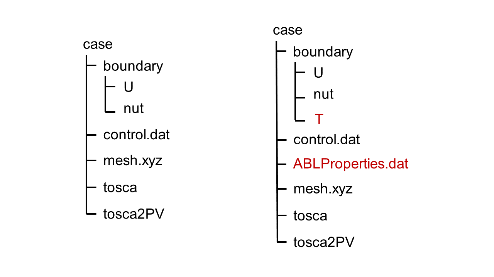

User Guide
==========

TOSCA uses ASCII input files, organized in files and dictionaries.  
The code provides some level of input checking, meaning that non-recognized inputs are followed by an error message that
lists available possibilities. 

TOSCA has a standardized case structure. The minimum-required case structure is depicted on the right of the following figure, 
while the case structure required to run e.g. atmospheric boundary layer (ABL) and wind farm simulations with potential 
temperature stratification is shown on the right (i.e. with the addition of the ``boundary/T`` and ``ABLProperties.dat`` files).
The principal control file for a TOSCA simulation is the `control.dat` file, located in the case directory (see 
:ref:`control-subsection` for details).
Depending on the type of simulation that one wishes to perform, flags can be activated in the `control.dat`, which prompt TOSCA 
to read additional input files and data. These are described in Sec. :ref:`input-files-section`.

   
Inside the ``boundary`` directory, initial and boundary conditions are set in files having the same name as the field they 
describe (see :ref:`boundary-subsection` for details).  

.. include:: user_guide/input_files.rst
.. include:: user_guide/spatial_mesh.rst

 
    
    
    
    
    
    
    
    
    
    
    
    
    
     
